# Qwen2-VL多模态大模型微调 图像识别


# 目录
- [Qwen2-VL多模态大模型微调 图像识别](#qwen2-vl多模态大模型微调-图像识别)
  - [相关介绍](#相关介绍)
  - [环境配置](#环境配置)
  - [数据集下载](#数据集下载)
  - [模型下载与加载](#模型下载与加载)
  - [集成SwanLab](#集成swanlab)
  - [开始微调](#开始微调)
  - [训练结果](#训练结果)
    - [推理LoRA微调后的模型](#推理lora微调后的模型)


## 相关介绍

Qwen2-VL是阿里通义实验室最新推出的多模态大模型。本文我们将简要介绍基于 transformers、peft 等框架，使用 Qwen2-VL-2B-Instruct 模型在**COCO2014图像描述** 上进行Lora微调训练，同时使用 [SwanLab](https://link.zhihu.com/?target=https%3A//github.com/swanhubx/swanlab) 监控训练过程与评估模型效果。

## 环境配置

确保电脑上至少有一张英伟达显卡（可打开任务管理器查看），并且已经安装好了CUDA环境

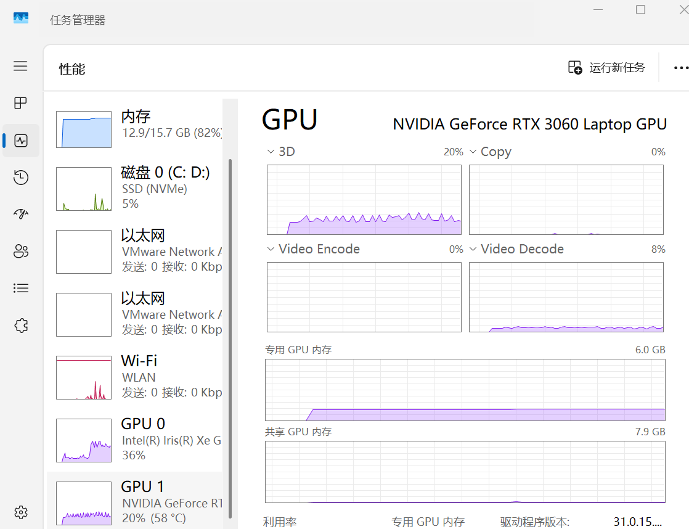

安装Python（版本>=3.8）以及能够调用CUDA加速的PyTorch

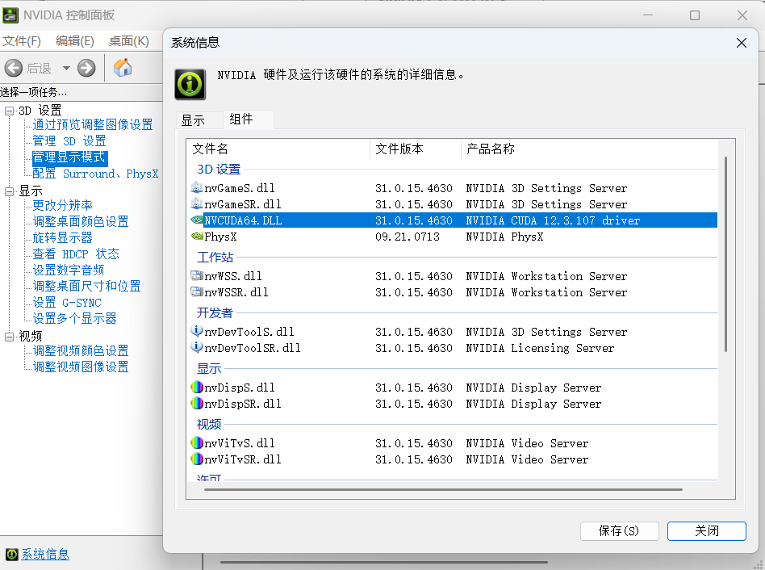

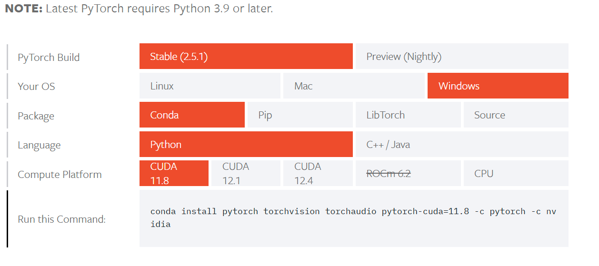


当然，正常电脑配置的显卡算力显然是不太够的，为了节省时间，就得花费金钱

可以去[AutoDL](https://www.autodl.com/home)租用对应配置的服务器，使用[Termius](https://termius.com/)连接，Linux系统环境下操作可比Windows简单的多）

连接成功以后

用conda创建需要版本的python环境

```python
conda create -n dandan_test python==3.11
```

进入环境

```python
conda activate dandan_test
```

如果失败，可能是需要初始化

```python
conda init
```

还是报错，应该是需要更新配置

`cd ~/`返回根目录，`ls -a`显示隐藏文件，`.bash`刷新，找到需要更新的配置文件用`source`更新

进入环境后，安装Qwen2-VL微调相关的第三方库，可以使用以下命令：

```python
python -m pip install --upgrade pip
pip config set global.index-url https://pypi.tuna.tsinghua.edu.cn/simple
# 更换 pypi 源加速库的安装
pip install modelscope==1.18.0
pip install transformers==4.46.2
pip install sentencepiece==0.2.0
pip install accelerate==1.1.1
pip install datasets==2.18.0
pip install peft==0.13.2
pip install swanlab==0.3.25
pip install qwen-vl-utils==0.0.8
pip install oss2
pip install addict
pip install torchvision
```

本节使用的是 coco_2014_caption 数据集，该数据集主要用于多模态（Image-to-Text）任务。

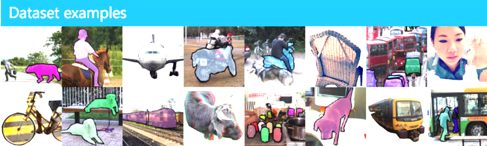

本次任务，主要使用其中的前500张图像，并进行处理和格式微调，目标是组成如下格式的json文件：

```json
{
    "id": "identity_1",
    "conversations": [
      {
        "from": "user",
        "value": "COCO Yes: <|vision_start|>图像文件路径<|vision_end|>"
      },
      {
        "from": "assistant",
        "value": "A snow skier assessing the mountain before starting to sky"
      }
    ]
},
...
```

其中，"from"是角色（user代表人类，assistant代表模型），"value"是聊天的内容，其中`<|vision_start|>`和`<|vision_end|>`是Qwen2-VL模型识别图像的标记，中间可以放图像的文件路径，也可以是URL。

## 数据集下载

- 下载coco_2014_caption数据集，可以通过[Modelscope](https://modelscope.cn/home)
- 加载数据集，保存图像到本地
- 将图像路径和描述转换为一个csv文件
- 将csv文件转换为json文件

**使用下面的代码完成从数据下载到生成csv的过程：**

data2csv.py

```python
# 导入所需的库
from modelscope.msdatasets import MsDataset
import os
import pandas as pd

MAX_DATA_NUMBER = 500

# 检查目录是否已存在
if not os.path.exists('coco_2014_caption'):
    # 从modelscope下载COCO 2014图像描述数据集
    ds =  MsDataset.load('modelscope/coco_2014_caption', subset_name='coco_2014_caption', split='train')
    print(len(ds))
    # 设置处理的图片数量上限
    total = min(MAX_DATA_NUMBER, len(ds))

    # 创建保存图片的目录
    os.makedirs('coco_2014_caption', exist_ok=True)

    # 初始化存储图片路径和描述的列表
    image_paths = []
    captions = []

    for i in range(total):
        # 获取每个样本的信息
        item = ds[i]
        image_id = item['image_id']
        caption = item['caption']
        image = item['image']

        # 保存图片并记录路径
        image_path = os.path.abspath(f'coco_2014_caption/{image_id}.jpg')
        image.save(image_path)

        # 将路径和描述添加到列表中
        image_paths.append(image_path)
        captions.append(caption)

        # 每处理50张图片打印一次进度
        if (i + 1) % 50 == 0:
            print(f'Processing {i+1}/{total} images ({(i+1)/total*100:.1f}%)')

    # 将图片路径和描述保存为CSV文件
    df = pd.DataFrame({
        'image_path': image_paths,
        'caption': captions
    })

    # 将数据保存为CSV文件
    df.to_csv('./coco-2024-dataset.csv', index=False)

    print(f'数据处理完成，共处理了{total}张图片')

else:
    print('coco_2014_caption目录已存在,跳过数据处理步骤')
```

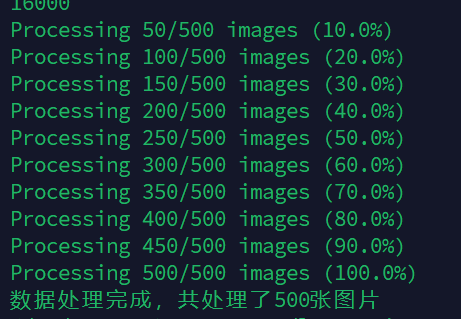	

**同一目录下，用以下代码，将csv文件转换为json文件：**

csv2json.py

```python
import pandas as pd
import json

# 载入CSV文件
df = pd.read_csv('./coco-2024-dataset.csv')
conversations = []

# 添加对话数据
for i in range(len(df)):
    conversations.append({
        "id": f"identity_{i+1}",
        "conversations": [
            {
                "from": "user",
                "value": f"COCO Yes: <|vision_start|>{df.iloc[i]['image_path']}<|vision_end|>"
            },
            {
                "from": "assistant", 
                "value": df.iloc[i]['caption']
            }
        ]
    })

# 保存为Json
with open('data_vl.json', 'w', encoding='utf-8') as f:
    json.dump(conversations, f, ensure_ascii=False, indent=2)
```

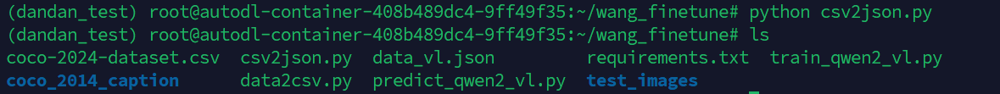

此时目录下会多出两个文件：

- coco-2024-dataset.csv
- data_vl.json

数据集准备完成

## 模型下载与加载

**这里是介绍，包括集成SwanLab功能都在train代码里**

这里我们使用modelscope下载Qwen2-VL-2B-Instruct模型（约4.5GB），然后把它加载到Transformers中进行训练：

```python
from modelscope import snapshot_download, AutoTokenizer
from transformers import TrainingArguments, Trainer, DataCollatorForSeq2Seq, Qwen2VLForConditionalGeneration, AutoProcessor
import torch

# 在modelscope上下载Qwen2-VL模型到本地目录下
model_dir = snapshot_download("Qwen/Qwen2-VL-2B-Instruct", cache_dir="./", revision="master")

# 使用Transformers加载模型权重
tokenizer = AutoTokenizer.from_pretrained("./Qwen/Qwen2-VL-2B-Instruct/", use_fast=False, trust_remote_code=True)
# 特别的，Qwen2-VL-2B-Instruct模型需要使用Qwen2VLForConditionalGeneration来加载
model = Qwen2VLForConditionalGeneration.from_pretrained("./Qwen/Qwen2-VL-2B-Instruct/", device_map="auto", torch_dtype=torch.bfloat16, trust_remote_code=True,)
model.enable_input_require_grads()  # 开启梯度检查点时，要执行该方法
```

## 集成SwanLab

SwanLab是一个开源的模型训练记录工具，由本校（西电）团队开发，面向AI研究者，提供了训练可视化，自动日志记录，超参数记录，实验对比，多人协同等功能。

SwanLab与Transformers已经做好了集成，用法是在Trainer的`callbacks`参数中添加`SwanLabCallback`实例，就可以自动记录超参数和训练指标，简化代码如下：

```python
from swanlab.integration.transformers import SwanLabCallback
from transformers import Trainer

swanlab_callback = SwanLabCallback()

trainer = Trainer(
    ...
    callbacks=[swanlab_callback],
)
```

首次使用SwanLab，需要先在[官网](https://swanlab.cn/)注册一个账号，然后在用户设置页面复制你的API Key，然后在训练开始提示登录时粘贴即可，后续无需再次登录

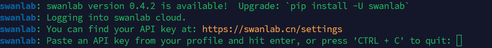

## 开始微调

代码执行目录结构

```data
|———— train_qwen2_vl.py
|———— coco_2014_caption
|———— coco-2024-dataset.csv
|———— data_vl.json
|———— data2csv.py
|———— csv2json.py
```

代码功能如下：

1. 下载并加载Qwen2-VL-2B-Instruct模型

2. 加载数据集，取前496条数据参与训练，4条数据进行主观评测
3. 配置Lora，参数为r=64, lora_alpha=16, lora_dropout=0.05
4. 使用SwanLab记录训练过程，包括超参数、指标和最终的模型输出结果
5. 训练2个epoch

train_qwen2_vl.py详细代码可去GitHub仓库查看，这里不过多赘述

## 训练结果

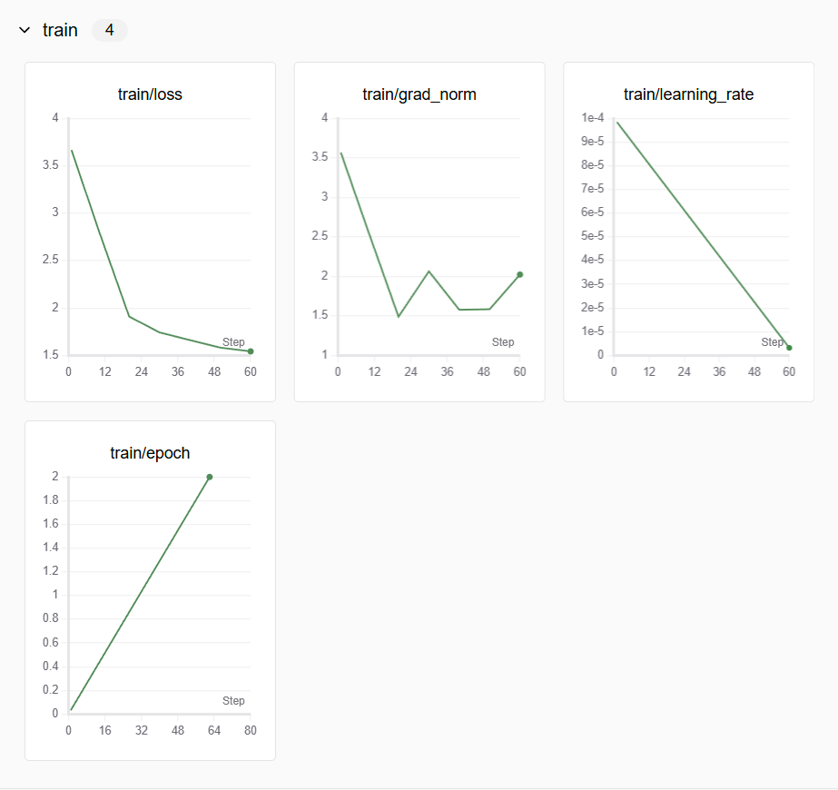


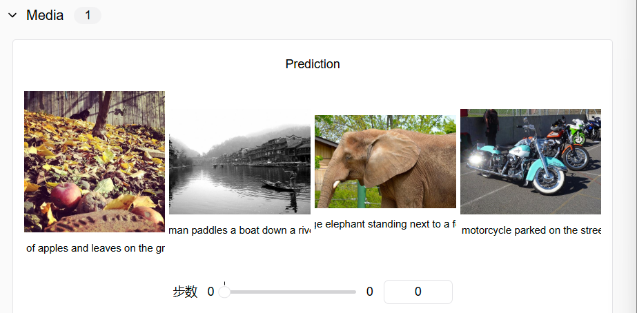

从SwanLab图表中我们可以看到，lr的下降策略是线性下降，loss随epoch呈现下降趋势，而grad_norm则在上升。这种形态往往反映了模型有过拟合的风险，训练不要超过2个epoch。

在`Media`图表中记录着模型最终的输出结果，可以看到模型在回答的风格上是用的COCO数据集的简短英文风格进行的描述

而同样的图像，没有被微调的模型输出结果如下：

```
1-没有微调：The image depicts a cozy living room with a rocking chair in the center, a bookshelf filled with books, and a table with a vase and a few other items. The walls are decorated with wallpaper, and there are curtains on the windows. The room appears to be well-lit, with sunlight streaming in from the windows.
1-微调后：A living room with a rocking chair, a bookshelf, and a table with a vase and a bowl.

2-没有微调：It looks like a family gathering or a party in a living room. There are several people sitting around a dining table, eating pizza. The room has a cozy and warm atmosphere.
2-微调后：A group of people sitting around a dining table eating pizza.
```

可以明显看到微调后风格的变化。

这里我们用`vim`打开predict_qwen2_vl.py来查看训练结果

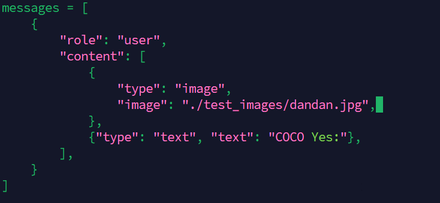	

更改这里需要预测的图片的路径

这里我们用两个图片测试了下

	

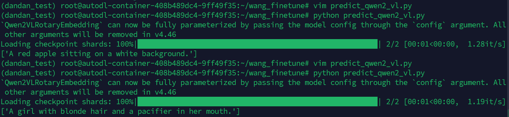

可以看到生成了对图片的描述

### 推理LoRA微调后的模型

```python
from transformers import Qwen2VLForConditionalGeneration, AutoProcessor
from qwen_vl_utils import process_vision_info
from peft import PeftModel, LoraConfig, TaskType

config = LoraConfig(
    task_type=TaskType.CAUSAL_LM,
    target_modules=["q_proj", "k_proj", "v_proj", "o_proj", "gate_proj", "up_proj", "down_proj"],
    inference_mode=True,
    r=64,  # Lora 秩
    lora_alpha=16,  # Lora alaph，具体作用参见 Lora 原理
    lora_dropout=0.05,  # Dropout 比例
    bias="none",
)

default: Load the model on the available device(s)

model = Qwen2VLForConditionalGeneration.from_pretrained(
    "./Qwen/Qwen2-VL-2B-Instruct", torch_dtype="auto", device_map="auto"
)
model = PeftModel.from_pretrained(model, model_id="./output/Qwen2-VL-2B/checkpoint-62", config=config)
processor = AutoProcessor.from_pretrained("./Qwen/Qwen2-VL-2B-Instruct")

messages = [
    {
        "role": "user",
        "content": [
            {
                "type": "image",
                "image": "测试图像路径",
            },
            {"type": "text", "text": "COCO Yes:"},
        ],
    }
]

Preparation for inference

text = processor.apply_chat_template(
    messages, tokenize=False, add_generation_prompt=True
)
image_inputs, video_inputs = process_vision_info(messages)
inputs = processor(
    text=[text],
    images=image_inputs,
    videos=video_inputs,
    padding=True,
    return_tensors="pt",
)
inputs = inputs.to("cuda")

Inference: Generation of the output

generated_ids = model.generate(**inputs, max_new_tokens=128)
generated_ids_trimmed = [
    out_ids[len(in_ids) :] for in_ids, out_ids in zip(inputs.input_ids, generated_ids)
]
output_text = processor.batch_decode(
    generated_ids_trimmed, skip_special_tokens=True, clean_up_tokenization_spaces=False
)
print(output_text)
```

